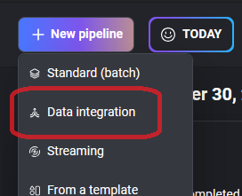
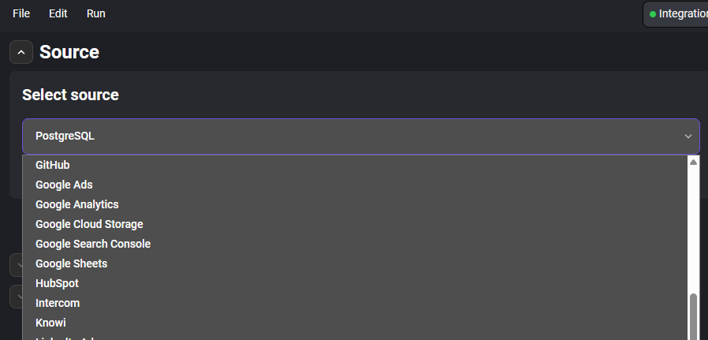
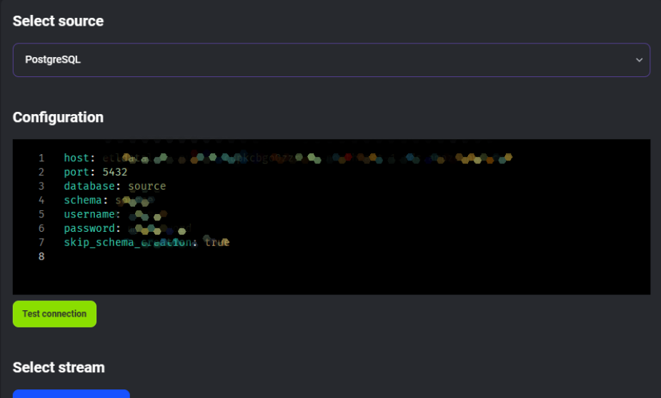
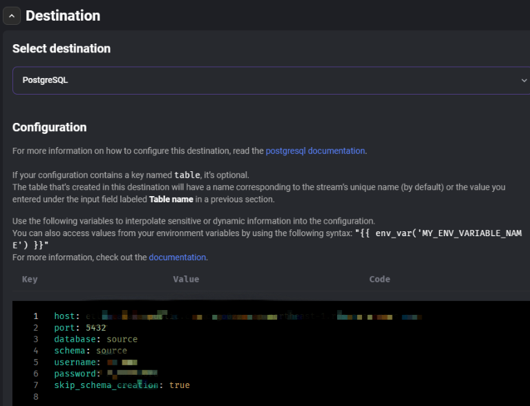

# 從資料庫抓取資料

## 一般情況

要從資料庫抓取資料，並存入其他資料庫，可以選擇 Data Integration Pipeline。

### 資料來源

首先在 source 根據來源資料庫填入資料。

例如我是 PosgreSQL，則如下填寫

然後點擊 <button style="	box-sizing: inherit;	margin: 0;	vertical-align: baseline;	cursor: pointer;	border: 1px solid rgb(23, 82, 255);	padding: 8px 12px;	font-family: Roboto Bold, Helvetica Neue, Helvetica, sans-serif;
	border-radius: 8px;
	font-size: 12px;
	line-height: 18px;
	background-color: rgb(23, 82, 255);
	color: rgb(255, 255, 255);">View and select streams</button> 選擇要抓取的 table。

### 匯出資料

Destination 區塊填入要匯出至哪個資料庫的資訊

### 資料庫連線寫法

source 和 destination 區塊的連線寫法是相同的，不過各種資料庫的連線寫法有所不同，可參閱 MageAI 官方提供的範本：https://github.com/mage-ai/mage-ai/tree/master/mage_integrations/mage_integrations/destinations
