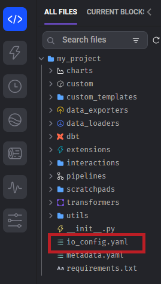
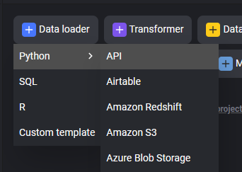
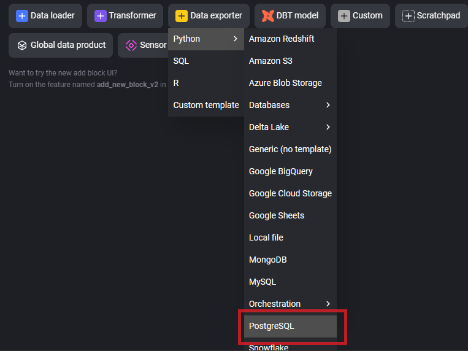

# 特殊：從 Oracle 11 抓取資料

Oracle 11 已經屬於較舊版本的資料庫了。所以 Mage 默認的 Oracle 連線並不支援 Oracle 11。

必須使用 Standard (batch) Pipeline 來處理。


Standard (batch) Pipeline 編輯畫面如下


## 設定連線資訊

為求省力，可以先將連線資訊寫入 config，以後就不用每次寫一遍。

MageAI 的 config 檔案是 `io_config.yaml`，可以在專案根目錄下找到。

Standard (batch) Pipeline 編輯畫面左側就有專案資料夾。



io_config.yaml 的內容大致如下：

```yaml
version: 0.1.1
default:
  # Default profile created for data IO access.
  # Add your credentials for the source you use, and delete the rest.
  # AWS
  AWS_ACCESS_KEY_ID: "{{ env_var('AWS_ACCESS_KEY_ID') }}"
  AWS_SECRET_ACCESS_KEY: "{{ env_var('AWS_SECRET_ACCESS_KEY') }}"
  # 下略……
``` 

在下方加上以下內容（根據 Oracle 實際狀況調整）

```yaml
OracleSource:
  connector_type: oracledb
  host: 10.0.100.200
  port: 1521
  service: foo   
  user: foo_smith
  password: bar1234
  mode: thick     
```

以上是 Oracle 11 的連線資訊範例。

而我們匯出的資料庫連線也建立一筆設定，這邊選用 PosgreSQL（根據實際狀況調整）

```yaml
PosgreSourceForWrite:
  POSTGRES_CONNECT_TIMEOUT: 10
  POSTGRES_HOST: example.ap-northeast-1.rds.amazonaws.com
  POSTGRES_PORT: 5432
  POSTGRES_DBNAME: source
  POSTGRES_SCHEMA: temp
  POSTGRES_USER: john.doe
  POSTGRES_PASSWORD: foobar1234
```

所以整個 io_config.yaml 會長得像這樣：

```yaml

version: 0.1.1
default:
  # Default profile created for data IO access.
  # Add your credentials for the source you use, and delete the rest.
  # AWS
  AWS_ACCESS_KEY_ID: "{{ env_var('AWS_ACCESS_KEY_ID') }}"
  AWS_SECRET_ACCESS_KEY: "{{ env_var('AWS_SECRET_ACCESS_KEY') }}"

  # 下略…… 

OracleSource:
  connector_type: oracledb
  host: 10.0.100.200
  port: 1521
  service: foo   
  user: foo_smith
  password: bar1234
  mode: thick    
PosgreSourceForWrite:
  POSTGRES_CONNECT_TIMEOUT: 10
  POSTGRES_HOST: example.ap-northeast-1.rds.amazonaws.com
  POSTGRES_PORT: 5432
  POSTGRES_DBNAME: source
  POSTGRES_SCHEMA: temp
  POSTGRES_USER: john.doe
  POSTGRES_PASSWORD: foobar1234 
```


## 抓取資料


首先選擇 Data Loader ，選擇任意的 Python 區塊。



接著在 Python 區塊中，輸入以下程式碼（根據需要，調整 query 變數）：

```python
from mage_ai.settings.repo import get_repo_path
from mage_ai.io.config import ConfigFileLoader
from mage_ai.io.oracledb import OracleDB
import pandas as pd
import oracledb
from os import path
if 'data_loader' not in globals():
    from mage_ai.data_preparation.decorators import data_loader
if 'test' not in globals():
    from mage_ai.data_preparation.decorators import test


@data_loader
def load_data(*args, **kwargs):
    """
    抓取 Oracle 資料的範本，根據要抓取的資料，修改 query 變數即可。

    Returns:
        Anything (e.g. data frame, dictionary, array, int, str, etc.)
    """

    # 根據你要查找的資料，修改此 query
    query = """
    SELECT * FROM FOO.SAMPLE_FILE
    """ 
    
    oracledb.init_oracle_client(lib_dir=None)  
    config_path = path.join(get_repo_path(), 'io_config.yaml')
    config_profile = 'OracleSource'
    config = ConfigFileLoader(config_path, config_profile) 

    conn = oracledb.connect(
        user=config.config['user'],
        password=config.config['password'],
        dsn="{}:{}/{}".format(
            config.config['host'],
            config.config['port'],
            config.config['service']
        )
    )
 

    df = pd.read_sql(query, conn)
    conn.close()
    return df


@test
def test_output(output, *args) -> None:
    """
    Template code for testing the output of the block.
    """
    assert output is not None, 'The output is undefined'

```

以上這段程式，會根據 `io_config.yaml` 中的 OracleSource 設定，連上 Oracle 11 資料庫，並執行 query 指令來抓取資料。


## 匯出資料


在 [Data Loader 抓完資料後](#抓取資料)，建立一個 Data Exporter 區塊。

由於資料庫是 Posgre，所以如下選擇



Data Exporter 區塊的程式碼如下：

```python
from mage_ai.settings.repo import get_repo_path
from mage_ai.io.config import ConfigFileLoader
from mage_ai.io.postgres import Postgres
from pandas import DataFrame
from os import path

if 'data_exporter' not in globals():
    from mage_ai.data_preparation.decorators import data_exporter


@data_exporter
def export_data_to_postgres(df: DataFrame, **kwargs) -> None:
    """
    Template for exporting data to a PostgreSQL database.
    Specify your configuration settings in 'io_config.yaml'.

    Docs: https://docs.mage.ai/design/data-loading#postgresql
    """
 
    schema_name = 'source'  # Specify the name of the schema to export data to
    table_name = 'erp_foo_bar_file'  # Specify the name of the table to export data to
    config_path = path.join(get_repo_path(), 'io_config.yaml')
    config_profile = 'PosgreSourceForWrite'

    with Postgres.with_config(ConfigFileLoader(config_path, config_profile)) as loader:
        loader.export(
            df,
            schema_name,
            table_name,
            index=False,  # Specifies whether to include index in exported table
            if_exists='replace',  # Specify resolution policy if table name already exists
        )
        loader.execute(f"""
            DO $$
            BEGIN
                IF NOT EXISTS (
                    SELECT 1
                    FROM pg_constraint
                    WHERE conname = 'pk_{schema_name}_${table_name}'
                ) THEN
                    ALTER TABLE {schema_name}.{table_name}
                    ADD CONSTRAINT pk_{schema_name}_${table_name}
                    PRIMARY KEY (foo01，foo02);
                END IF;
            END $$; 
        """)
```

以上這段程式碼根據 `schema_name`、`table_name` 變數、先前在 `io_config.yaml` 建立的 `PosgreSourceForWrite` 設定，將抓取到的資料，匯出到 Posgre 資料庫中。

此外，匯出的資料的 Table 會建立 Primary Key，欄位為 foo01 + foo02。