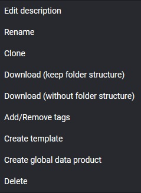

## Integration Pipeline

Integration Pipeline 如果以操作 GUI 的方式，只能使用複製 pipeline 的方式共用 block

### 複製 pipeline

首先在已經有的 pipeline 右鍵

選擇 `Clone`，這樣就會新增一個新的 pipeline，loader / export 與原本的 pipeline 相同。

由於在 mage AI 中，Integration Pipeline 的 loader / export 只儲存連線設定，不儲存處理的資料庫 table，新舊 pipeline 可以處理不同 table

例如我一個處理複製 `foo` table；另一個處理 `bar` table，但處理不同的資料。

#### ⚠️ 注意事項

使用 Clone 的話，新舊 pipeline 是使用同一個 loader / export 的，所以如果在其中一個 pipeline 修改了 loader / export 的設定，另一個 pipeline 也會跟著改變。