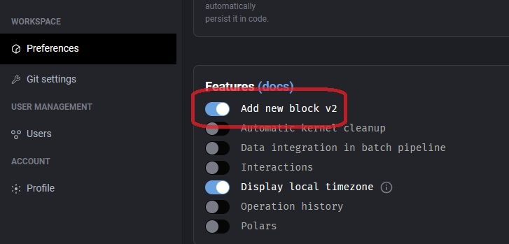
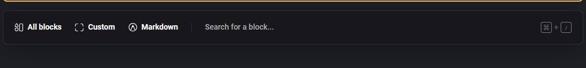
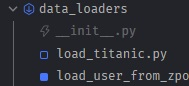
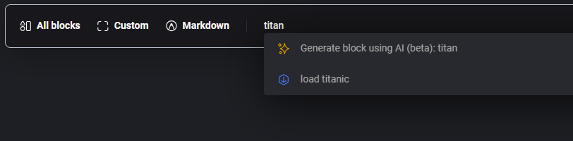

# Standard Pipeline 共用區塊

## 事前準備

要先到 Settings > Preferences > Features ，開啟「Add new block v2」

## 共用區塊

開啟了「Add new block v2」後，進入 pipeline 的編輯頁，新增區塊的選項會如下

假設我現在有以下 block

在「Search for a block...」查詢，選擇你要的 block 即可。

